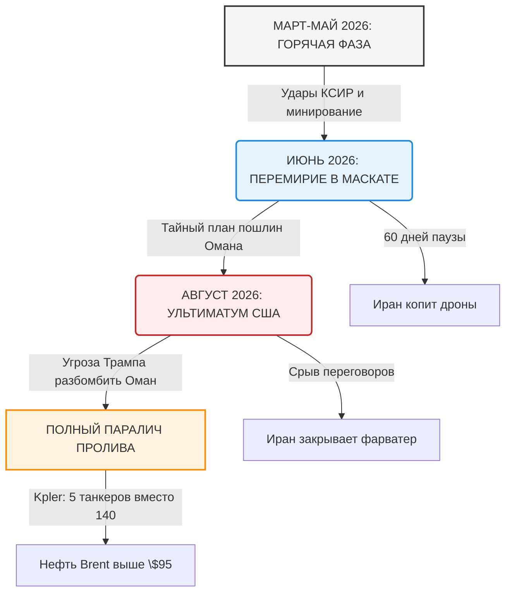
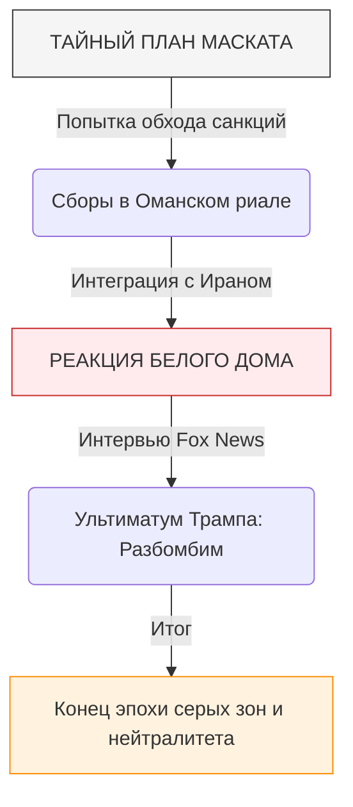
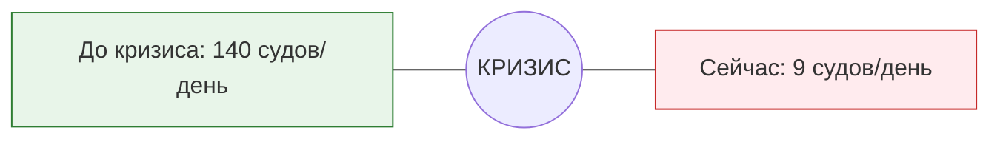
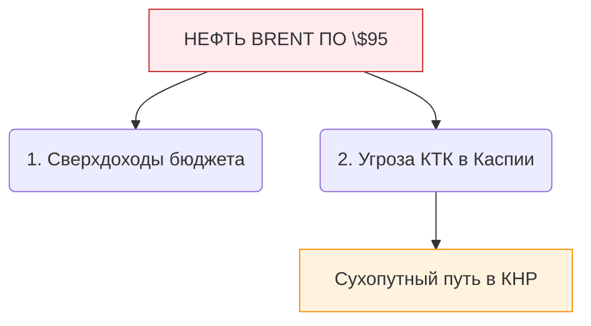
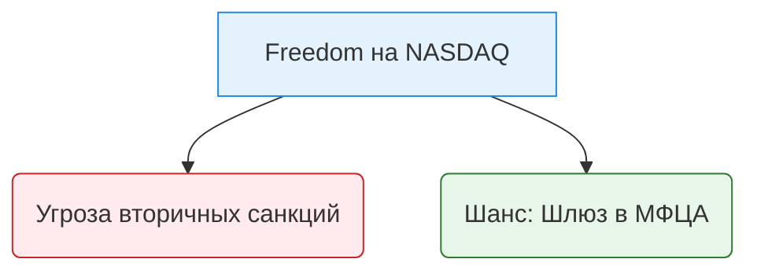

# Ормузский узел 2026: Театр барокко, сырьевой коллапс и крах ближневосточной дипломатии

## ВВЕДЕНИЕ: ГЕОГРАФИЯ КАК ВЫСШИЙ СУД ТЕХНОРЕАЛИЗМА

События вокруг Ормузского пролива летом 2026 года окончательно похоронили иллюзию глобального либерального рынка, управляемого из виртуальных финансовых центров. Мир столкнулся с жестким, бескомпромиссным проявлением технореализма. На смену транснациональным правилам пришла физическая география, превращенная в абсолютное оружие. 

Ормузский пролив — узкое горлышко шириной всего в 39 километров — стал главной сценой новой барочной драмы, где разыгрывается сюжет о границах государственного суверенитета и праве силы. Это прямое продолжение концепции Технологической Вестфалии: тот, кто контролирует ключевой физический узел планеты, диктует свои условия глобальным ИТ-империям, сырьевым биржам и суверенным государствам.

---

## 1. ХРОНИКА ПОСЛЕВОЕННЫХ ПЕРЕГОВОРОВ: ОТ ГОРЯЧЕЙ ФАЗЫ К АДМИНИСТРАТИВНОМУ ТУПИКУ

Чтобы понять глубину текущего кризиса, необходимо восстановить хронологию событий, последовавших за завершением открытых боевых действий в Персидском заливе весной этого года.

### Горячий финал (Март — Май 2026 года)
Горячая фаза конфликта, ознаменовавшаяся массированным обменом ракетными ударами между Корпусом стражей исламской революции (КСИР) Ирана и коалицией во главе с США, завершилась оперативным тупиком. Физическое уничтожение трех крупных нефтеналивных танкеров в самой узкой части пролива и минирование фарватера полностью парализовали судоходство. Попытки ВМС США провести силовую операцию по разминированию под шквальным огнем береговых противокорабельных комплексов Ирана привели к неприемлемым потерям в корабельном составе. 

### Соглашение в Маскате: Призрачный компромисс (Июнь 2026 года)
При посредничестве Султаната Оман стороны согласились на введение временного 60-дневного режима прекращения огня. Переговорный трек, развернутый в Маскате, изначально нес в себе семена собственного краха, так как стороны преследовали взаимоисключающие цели:
* **Требования Тегерана**: Полная и безоговорочная отмена эмбарго на экспорт иранской нефти, размораживание центробанковских активов в европейских банках на сумму $45 млрд и вывод тяжелых кораблей ВМС США за пределы Оманского залива.
* **Требования Вашингтона**: Демонтаж ракетных баз КСИР на островах Абу-Муса, Большой и Малый Томб, передача контроля над безопасностью судоходства международному контингенту под эгидой ООН (фактически — под контролем Пентагона) и прекращение ядерной программы Ирана.

Переговоры двигались по спирали. Иран использовал паузу для восполнения арсенала дронов-камикадзе и восстановления поврежденных пусковых установок. США в это время перебрасывали в регион дополнительные эскадрильи истребителей пятого поколения и развертывали новые радарные комплексы на территории Саудовской Аравии.

### Истечение срока и слом дипломатии (Август 2026 года)
В понедельник, по истечении 60-дневного срока, временное перемирие официально прекратило свое действие. Переговорный процесс в Маскате окончательно зашел в тупик. Иранская делегация покинула Оман, заявив, что администрация Дональда Трампа «способна общаться только на языке диктата и не уважает суверенные права наций». 

Сразу после этого Спикер парламента Ирана Мохаммад-Багер Галибаф выступил с официальным обращением, в котором объявил: Ормузский пролив закрывается для любого коммерческого судоходства до тех пор, пока США не снимут экономическую удавку с Тегерана. С этого момента мир официально вернулся в состояние гибридной морской войны.

---

## 2. АНАТОМИЯ БАРОЧНОГО ТЕАТРА: ДВЕ ВЕРСИИ РЕАЛЬНОСТИ

Текущая фаза кризиса приобрела черты классического барочного театра, где внешняя пышность, громкие декларации и иллюзорные эффекты призваны скрыть суровую, асимметричную физическую реальность. На геополитической сцене одновременно разыгрываются два совершенно разных сценария.

### Сцена 1: Иллюзия доминирования (Декларации Вашингтона)
Белый дом действует в логике абсолютного имперского превосходства. Президент США Дональд Трамп в своем фирменном стиле выступил с серией заявлений, утверждающих, что Ормузский пролив «находится под полным, стопроцентным и неоспоримым контролем доблестных американских военных». Администрация пошла на беспрецедентный шаг, опубликовав обновленные навигационные карты, где Ормузский пролив фактически объявлен «зоной прямого оперативного управления США». 

Официальные представители Пентагона заявляют, что американские военные успешно проводят конвои из 15–20 супертанкеров за ночь через южный коридор, пролегающий в территориальных водах Омана. Цель этой информационной кампании очевидна — сбить панику на Уолл-стрит и не допустить катастрофического обрушения финансовых рынков перед выборами. В этой виртуальной реальности США остаются единоличным гегемоном, способным силой оружия гарантировать свободу мореплавания.

### Сцена 2: Террор узкого горлышка (Реальность Тегерана)
Вторая версия реальности, транслируемая Ираном и подтверждаемая независимыми спутниковыми данными, выглядит совершенно иначе. Командование КСИР назвало заявления Трампа «дешевым блефом для некомпетентной публики». На практике Иран перешел к тактике точечного технологического террора в проливе. 

Вместо использования крупных военно-морских сил, Иран применяет концепцию «роя» и скрытных ударов:
1. **Дистанционное минирование**: Использование подводных беспилотных аппаратов для хаотичного обновления минных полей на фарватере.
2. **Береговая артиллерия и ракеты**: Развернутые в гранитных гротах побережья полуавтономные ракетные комплексы «Нур» и «Кадер» держат под прицелом каждый квадратный метр водной глади.
3. **Атаки на коммерческий флот**: Только за последние 72 часа неопознанными барражирующими боеприпасами были атакованы три гражданских судна, рискнувших пройти через пролив без прямого военного эскорта. На одном из танкеров под флагом Либерии вспыхнул пожар, погиб член экипажа. Иран наглядно демонстрирует: ни одно судно не может чувствовать себя в безопасности в зоне досягаемости его суверенного берега.
---
---

## 3. УЛЬТИМАТУМ ОМАНУ: РАЗРУШЕНИЕ ДИПЛОМАТИЧЕСКИХ МОСТОВ ЕВРАЗИИ

Самым драматичным витком августовского кризиса стал фактический демонтаж многолетней дипломатической архитектуры Ближнего Востока. Султанат Оман, исторически выполнявший роль «Ближневосточной Швейцарии» и главного закрытого канала связи между Вашингтоном и Тегераном, сам оказался под ударом геополитического молота.

### Закулисный план Султаната
Осознавая, что затяжная блокада пролива полностью уничтожит портовую инфраструктуру региона, Маскат попытался сыграть в собственную вестфальскую игру. Оманские дипломаты предложили Ирану сепаратный правовой механизм: коммерческие суда перенаправляются в оманские территориальные воды, а Султанат берет на себя администрирование транзита. За это вводился специальный «транзитный сбор», который де-факто делился бы между Маскатом и Тегераном в обход американской финансовой системы — расчеты планировалось вести в оманских риалах и юанях.

### Ответный удар Вашингтона
Реакция администрации Дональда Трампа оказалась демонстративно жестокой и лишенной традиционного дипломатического лоска. В прямом эфире телеканала Fox News американский президент вскрыл тайные переговоры и выставил султану Омана прямой военный ультиматум: *«Если Оман встанет у нас на пути или попытается собирать деньги в карман Тегерана, мы разбомбим их инфраструктуру к чертям»*.

Этот шаг зафиксировал ключевой тренд Технологической Вестфалии:
* **Ликвидация «серых зон»**: Ядерные сверхдержавы больше не терпят двурушничества и балансирования малых стран между блоками.
* **Крах классического посредничества**: Оман полностью утратил статус нейтрального шлюза. Маскат был вынужден экстренно свернуть переговоры с Ираном, оставив Персидский залив один на один с физической угрозой войны.

---

## 4. СЫРЬЕВОЙ КОЛЛАПС: КОГДА ФИЗИКА ТАНКЕРОВ СИЛЬНЕЕ ВИРТУАЛЬНЫХ ДОЛЛАРОВ

Пока на экранах телевизоров разворачивается битва заявлений Белого дома и КСИР, реальный мировой бизнес голосует цифрами. Сырьевой рынок мгновенно отбросил политическую риторику и отреагировал на закрытие фарватера сухими фактами физического дефицита.

### Статистика Kpler: Танкерный паралич
До начала весенней горячей фазы войны через Ормузский пролив ежедневно проходило в среднем **от 130 до 140 крупных коммерческих судов**, включая супертанкеры класса VLCC, обеспечивавшие до 20% мирового потребления нефти и СПГ. 

Последние спутниковые данные независимого аналитического агентства Kpler показывают катастрофическую картину: за прошедшие сутки через узкое горлышко пролива отважились пройти всего **9 гражданских судов**. Из них 5 — это мелкие региональные сухогрузы, и лишь 4 — танкеры, идущие под прямым конвоем американских эсминцев. Крупнейшие государственные судоходные компании Китая (COSCO) и стран Персидского залива официально ввели полный запрет на фрахт судов в акватории до стабилизации обстановки.

### Страховой бойкот Лондона
Главным триггером полной остановки трафика стал не столько страх перед иранскими ракетами, сколько решение страхового рынка. Лондонский синдикат **Lloyd’s** и Объединенный военный комитет (JWC) крупнейших мировых страховщиков объявили весь Персидский и Оманский заливы «зоной абсолютного военного исключения». 

* **Отзыв полисов**: Страховое покрытие для гражданских судов в регионе было аннулировано. 
* **Экономический барьер**: Идти через пролив без международной страховки не рискнет ни один судовладелец в мире — в случае уничтожения судна убытки в $150–200 млн мгновенно обанкротят компанию. Виртуальная финансовая система Лондона одним росчерком пера запечатала пролив надежнее, чем иранские минные поля.

### Ценовое ралли Brent
Физическое отсутствие ближневосточной нефти на НПЗ в Европе и Азии привело к паническому ралли на сырьевых биржах. Стоимость эталонного сорта нефти марки **Brent стремительно пробила уровень в $91 и закрепилась в коридоре $93.60 – $95.40 за баррель**. Эксперты инвестиционных банков Уолл-стрит открыто заявляют: если пролив останется заблокированным еще две недели, мировая экономика столкнется с ценой в **$120 за баррель**, что спровоцирует масштабную глобальную рецессию.

---
---

## 5. ЕВРАЗИЙСКОЕ ЭХО: КАЗАХСТАНСКИЙ ТРАНЗИТ ПОД УДАРОМ БЛОКАДЫ

Паралич Ормузского пролива эхом отозвался за тысячи километров от Персидского залива — в Центральной Азии. С позиции технореализма, Казахстан, пытавшийся выстроить многовекторную модель цифрового и сырьевой транзита, оказался в зоне критического риска.

### Двуликий сырьевой фактор
С одной стороны, закрепление цены на нефть Brent выше **$93–$95 за баррель** обеспечивает бюджету Казахстана колоссальный приток валютной выручки. С другой стороны, физическая блокировка глобальных морских путей ломает логистику Каспийского Трубопроводного Консорциума (КТК), через который идет основной объем казахстанского экспорта. Рынок Европы, лишившись арабской нефти, требует увеличения поставок, но запертые страховые рынки и дефицит танкеров в Новороссийске создают инфраструктурный затор.

### Технологический разлом
Энергетический кризис, вызванный Ормузом, заставляет транснациональные ИТ-корпорации пересматривать свои планы на проект «Долины дата-центров» в Павлодарской области. Дефицит чипов и удорожание логистики оборудования из-за санкций Pax Silica делают американские предложения Presidio AI слишком дорогими. Астана вынуждена ускорять интеграцию с китайской экосистемой WAICO и сетями 5G от Huawei, что вызывает жесткое недовольство Вашингтона и угрозы вторичных санкций.

---

## 6. КЕЙС FREEDOM HOLDING CORP.: ФИНАНСОВЫЕ РИСКИ НА ЛЕЗВИИ БРИТВЫ

Для крупнейшего инвестиционного и финтех-игрока региона — холдинга Freedom Holding Corp. под руководством Тимура Турлова — Ормузский кризис стал моментом высшей стратегической проверки. Торгуясь на американской бирже NASDAQ, компания зажата между жестким регулированием США и реалиями евразийского рынка.

### Санкционная воронка (BIS и SEC)
Резкий взлет цен на нефть заставляет США усиливать финансовый мониторинг любых транзакций в Евразии, чтобы перекрыть каналы обхода санкций. Для структур Freedom Holding возникает риск «токсичного контакта»: если транзитные потоки, обслуживаемые холдингом в рамках ШОС, пересекутся с расчетами за поставки сырья в обход американского доллара, холдинг рискует попасть под блокирующие санкции США. Это мгновенно приведет к делистингу с NASDAQ и параличу Freedom Банка внутри Казахстана.

### Окно возможностей: Цифровой оффшор МФЦА
В то же время, если холдингу удастся удержать баланс, Ормузский тупик превращает его в уникального транзитного монополиста. На фоне блокировки южных морских путей весь невоенный обмен данными, логистические контракты и финансовые шлюзы между Европой и Азией смещаются на сухопутные маршруты Среднего коридора. Использование правового каркаса Международного финансоческого центра «Астана» (МФЦА) позволяет Freedom Holding создать изолированную структуру для работы с Глобальным Югом, сохранив чистый американский контур для NASDAQ. В случае успеха капитализация холдинга способна обновить исторические максимумы.

---

## 7. ТЕХНОГРАФИЯ БУДУЩЕГО: СЦЕНАРИИ РАЗВИТИЯ КРИЗИСА ДО 2030 ГОДА

Опираясь на принципы технореализма, мы можем спрогнозировать три долгосрочных сценария развития Ормузского узла в рамках новой Технологической Вестфалии.

### Сценарий 1: Перманентная блокада и «Глобальный раскол»
* **Вероятность**: высокая.
* **Суть**: Переговоры в Маскате не возобновляются. США закрепляют за проливом статус постоянной зоны военных действий. Трафик падает до нуля. Мировая экономика адаптируется: строятся новые нефтепроводы через Саудовскую Аравию к Красному морю и сухопутные маршруты через Пакистан и Китай. Нефть стабильно держится выше **$100**. Мир окончательно разделяется на две автономные экономические и технологические цивилизации со своими изолированными ценами на ресурсы.

### Сценарий 2: Вестфальский компромисс (Новые шлюзы)
* **Вероятность**: средняя.
* **Суть**: Осознавая угрозу неконтролируемой рецессии, Вашингтон и Пекин заставляют Тегеран пойти на сделку. США официально не снимают санкции, но закрывают глаза на запуск «оманского механизма» пошлин. Пролив открывается под управлением регионального консорциума. Казахстан и ОАЭ получают статус официальных «цифровых и сырьевых оффшоров», где происходит жестко контролируемый, легальный обмен ресурсами и данными между блоками Pax Silica и WAICO.

### Сценарий 3: Ресурсный нокаут Запада
* **Вероятность**: умеренная.
* **Суть**: Иран полностью блокирует пролив, а Китай вводит встречные ограничения на экспорт очищенных редкоземельных металлов. США сталкиваются с одновременным шоком: дефицитом топлива и остановкой полупроводниковых заводов в Аризоне из-за отсутствия галлия. Экономический кризис вынуждает Белый дом пойти на попятную, отменить морскую блокаду Ирана и сесть за стол переговоров для подписания нового глобального соглашения о разделе сфер влияния.

---

## ЗАКЛЮЧЕНИЕ: МАНИФЕСТ ТЕХНОРЕАЛИЗМА

Ормузский кризис 2026 года — это не временный сбой в цепочках поставок, а фундаментальный маркер новой исторической эпохи. Иллюзия того, что глобальные финансы и цифровые платформы могут существовать в отрыве от физических узлов планеты, разрушена. 

Победителем в мире Технологической Вестфалии станет не тот, кто контролирует виртуальные индексы на биржах, а тот, кто удерживает физические точки контроля: проливы, сырьевые месторождения, полупроводниковые фабрики и атомные реакторы дата-центров. Для суверенных игроков евразийского пространства наступает время ювелирной точности: любая ошибка в выборе технологического или финансового партнера теперь означает немедленное стирание с карты глобального рынка.
